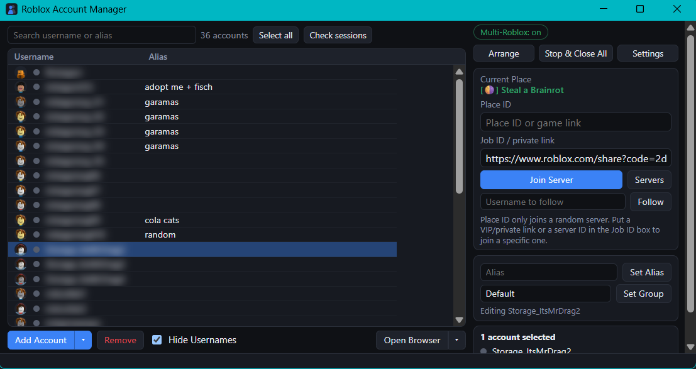

# Roblox Account Manager (V2)


[](https://github.com/Rickagon/Roblox-Account-Manager/releases/latest)
[](LICENSE)

A modern Roblox account manager built in Electron + Node. Manage many Roblox
accounts, launch them into games, run several clients at once, and keep
sessions alive.

> This repo contains **only the app code** - no accounts, cookies or passwords.
> Your accounts are stored, encrypted, in `%USERPROFILE%\.roblox-account-manager-v2`
> on the machine you run it on, and never in this project.

## Screenshots

<!-- Drop a screenshot at docs/screenshot.png (tip: turn on "Hide Usernames"
     first so no account names are shown) and it will appear here. -->


## Download & run (no terminal, no Node)

1. Go to the **[latest release](https://github.com/Rickagon/Roblox-Account-Manager/releases/latest)**.
2. Download **`RobloxAccountManager-win-x64.zip`**.
3. **Unzip it** anywhere (e.g. your Desktop). Keep the whole folder together.
4. Open the folder and double-click **`Roblox Account Manager.exe`**.

That's it - no install, no command line. To keep it handy, right-click the .exe →
**Send to → Desktop (create shortcut)**, or **Pin to taskbar**.

> Windows SmartScreen may show "Windows protected your PC" because the app isn't
> code-signed. Click **More info → Run anyway**. It's an unsigned Electron app, not
> malware - scan it with Windows Defender if you want to be sure.

## First-time setup

- **Add Account ▾ → Import from RAM** to bring in your accounts from a
  `AccountData.json` file. No password needed - it's protected by your Windows login.
- Or **Add Account** (manual login), **Auto login** (paste `user:pass` lines), or
  **Login with cookie(s)**.

## Features

- Encrypted local account vault (Windows DPAPI)
- Launch into a place, a specific server, a VIP/private link, or follow a user
- Multi-Roblox (run several clients at once), with a max-clients limit
- Stays in the system tray so it holds the Multi-Roblox lock all session; option to
  start hidden at Windows startup
- Automatic cookie refresh + a scheduled keep-alive so sessions don't expire
- Account browser per account (your installed Chrome/Edge, one profile each)
- Alias, groups, drag-select, right-click menu, Account Utilities (display name,
  password, privacy, summary)

## What it does NOT do

No FPS unlock, no captcha-solving automation. You solve any captcha yourself.

## Data location

`%USERPROFILE%\.roblox-account-manager-v2\` - `accounts.dat` (encrypted), `settings.json`,
and one browser profile per account under `profiles\`.

## Anonymous usage data

This app sends a small, **anonymous** usage ping when it starts. By using the
app you agree to this. It is used only to count installs/active use and see
which version people run.

It sends **only**:

- a random install ID (generated once, not tied to you or any account),
- the app version,
- your Windows version,
- a rough bucket of how many accounts you have (e.g. `6-20`).

It does **not** send - ever - your accounts, cookies, passwords, usernames,
user IDs, game/server details, or anything that identifies you. Your accounts
never leave your PC.

---

## Build from source (developers only)

End users do **not** need this - use the release zip above. To run or rebuild from
source you need [Node.js](https://nodejs.org) (v18 or newer):

```bash
git clone <your-repo-url>
cd Roblox-Account-Manager
npm install
npm start          # run in dev
npm run pack       # build the standalone .exe into dist/
```

The packaged app appears in
`dist\Roblox Account Manager-win32-x64\Roblox Account Manager.exe`.

## License

[MIT](LICENSE)

